# Docker Stack

A comprehensive Docker-based application stack featuring a Flask web application with MySQL database, NGINX reverse proxy, and integrated observability tools for monitoring and logging.

## 🏗️ Architecture Overview

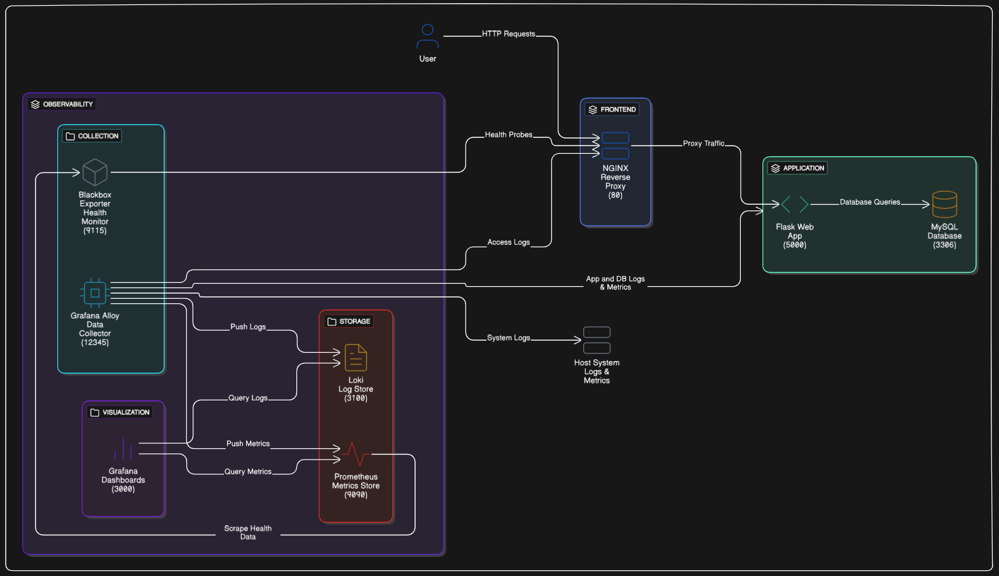
*Docker Stack Architecture - Core components and data flow*

This project implements a complete containerized application stack with built-in observability:

- **Application Layer**: Flask web application with MySQL database
- **Reverse Proxy**: NGINX for load balancing and routing
- **Metrics Collection**: Prometheus with Blackbox Exporter for application monitoring
- **Log Aggregation**: Grafana Loki for centralized logging
- **Data Collection**: Grafana Alloy for unified telemetry collection
- **Visualization**: Grafana dashboards for metrics and logs

## 📋 Services

| Service | Port | Description |
|---------|------|-------------|
| **NGINX** | 80 | Reverse proxy and load balancer |
| **Flask App** | 5000 | Python web application |
| **MySQL** | 3306 | Database server |
| **Grafana** | 3000 | Visualization and dashboards |
| **Prometheus** | 9090 | Metrics collection and storage |
| **Loki** | 3100 | Log aggregation system |
| **Alloy** | 12345 | Telemetry data collection agent |
| **Blackbox Exporter** | 9115 | Application health monitoring |

## 🚀 Quick Start

### 1. Clone and Start

```bash
cd docker-stack

# Start all services
./scripts/start.sh
```

### 2. Access Services

- **Application**: http://localhost
- **Grafana**: http://localhost:3000 (admin/admin)
- **Prometheus**: http://localhost:9090
- **Alloy**: http://localhost:12345


## 🖥️ Service Interfaces

### Flask Application
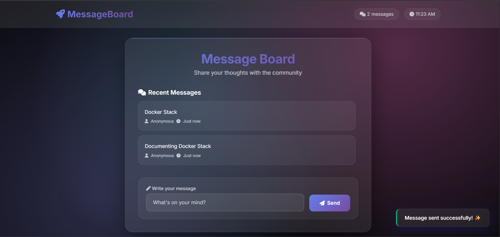
*Main Flask web application interface*

### Prometheus Monitoring
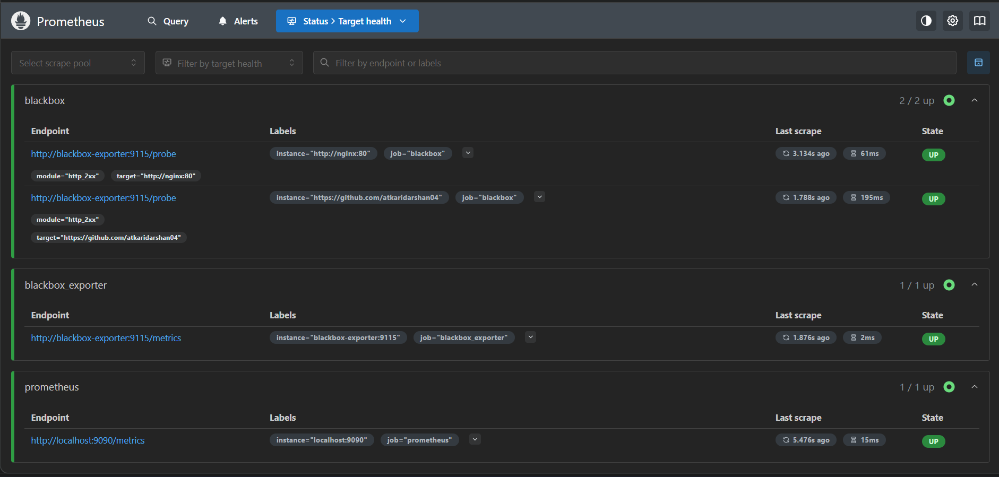
*Prometheus target monitoring and health status*

### Grafana Alloy
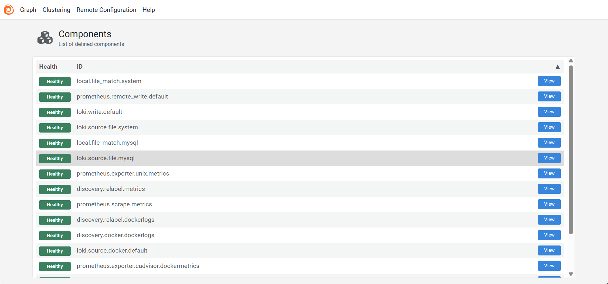
*Grafana Alloy Components Graph*

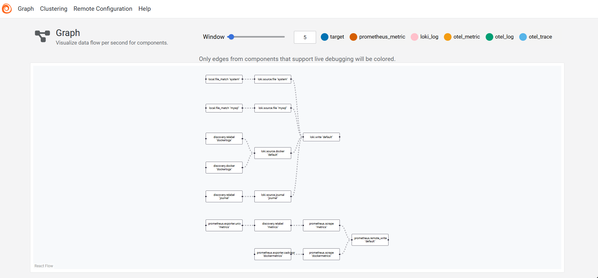
*Alloy data flow and processing graph*

### Blackbox Exporter
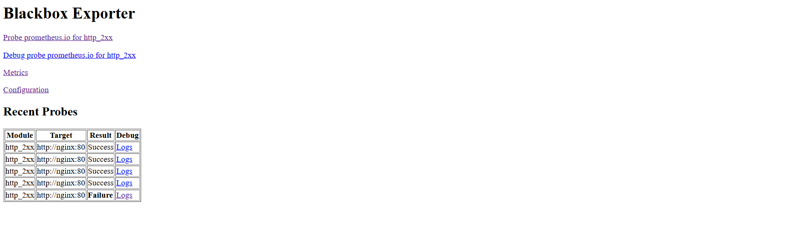
*Blackbox exporter metrics and probe results*


## 📊 Monitoring Dashboards

The stack includes pre-configured Grafana dashboards for comprehensive observability:

### System Monitoring
- **Node Exporter Dashboard** (ID: 1860) - System metrics and performance
- **Docker Container Dashboard** (ID: 193) - Container resource usage
- **MySQL Dashboard** (ID: 7587) - Database performance metrics
- **Blackbox Exporter Dashboard** (ID: 13639) - Application uptime monitoring

### Dashboard Screenshots

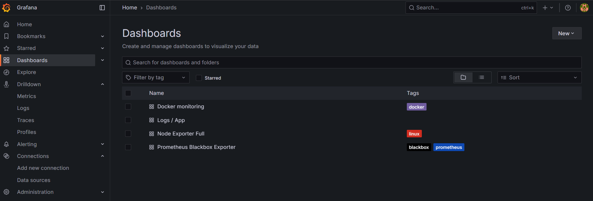
*Available Grafana dashboards overview*

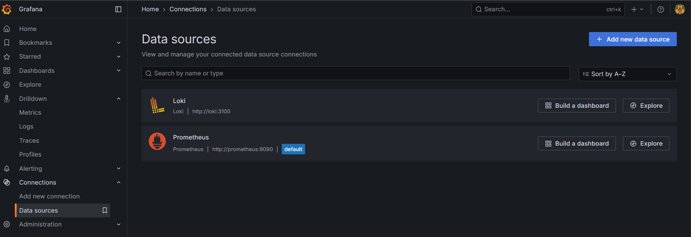
*Configured Grafana data sources*

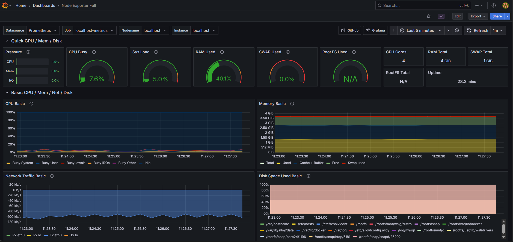
*System metrics and performance monitoring*

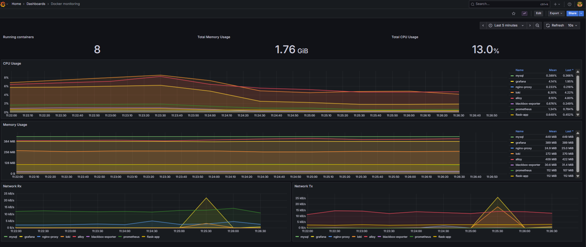
*Container resource usage and health*

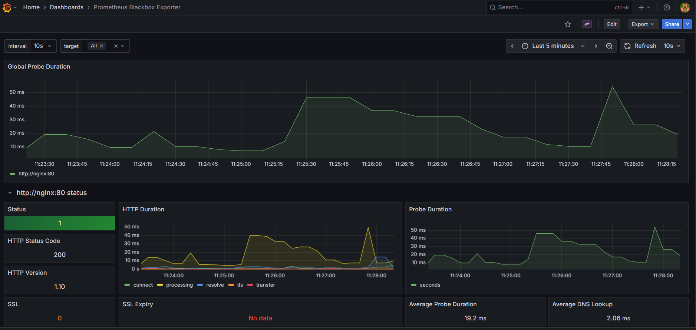
*Application uptime and health monitoring*

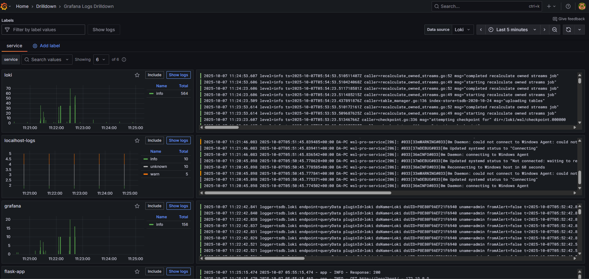
*Centralized log analysis with Loki*

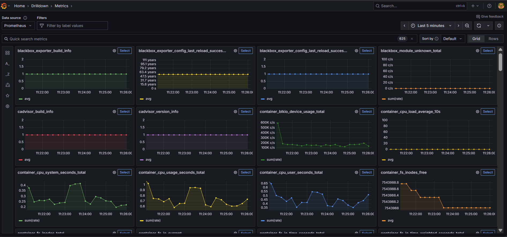
*Detailed metrics analysis and correlation*


## 🔍 Features

### Application Stack
- **Flask Web Application**: Python-based web server with health endpoints
- **MySQL Database**: Persistent data storage with initialization scripts
- **NGINX Reverse Proxy**: Load balancing and request routing
- **Docker Orchestration**: Multi-container deployment with health checks

### Observability
- **Metrics Collection**: Application and system performance monitoring
- **Log Aggregation**: Centralized logging from all services
- **Health Monitoring**: Automated service health checks and alerts
- **Visualization**: Real-time dashboards and analytics

### Domain & SSL Management
- **NGINX Proxy Manager**: Web-based reverse proxy management with SSL automation
- **Let's Encrypt Integration**: Automatic SSL certificate generation and renewal
- **Custom Domain Support**: Easy domain configuration and routing


*Grafana dashboard showing Blackbox monitoring through proxy*

For detailed setup and results, see [Domain and SSL Configuration](./nginx-proxy-manager.md).

## Clean Up

```bash
./scripts/stop.sh
```
