# Docker Stack

A production-style containerized application stack — Flask + MySQL behind NGINX, with full observability via Prometheus, Loki, and Grafana. Everything runs with a single command.

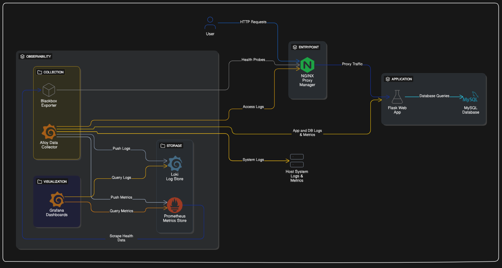

---

## Stack

| Service | Host Port | Role |
|---------|-----------|------|
| **NGINX** | `80` | Reverse proxy — sole public entry point |
| **Flask App** | — | Python web app (internal only, behind NGINX) |
| **MySQL** | — | Database (internal only) |
| **Grafana** | `3000` | Dashboards — metrics + logs |
| **Prometheus** | `9090` | Metrics collection and storage |
| **Loki** | `3100` | Log aggregation |
| **Alloy** | `12345` | Telemetry agent (metrics + logs → Prometheus/Loki) |
| **cAdvisor** | `8080` | Per-container resource metrics |
| **mysqld-exporter** | `9104` | MySQL metrics for Prometheus |
| **Blackbox Exporter** | `9115` | HTTP uptime probing |

---

## Quick Start

### Prerequisites

- Docker 20.10+ and Docker Compose v2
- `secrets/db_root_pw.txt` and `secrets/db_admin_pw.txt` must exist

```bash
# Create secrets (local dev values)
echo -n "root"  > secrets/db_root_pw.txt
echo -n "admin" > secrets/db_admin_pw.txt
```

### Start

```bash
./scripts/start.sh
```

### Access

| Interface | URL | Credentials |
|-----------|-----|-------------|
| Application | http://localhost | — |
| Grafana | http://localhost:3000 | `admin` / `admin` |
| Prometheus | http://localhost:9090 | — |
| Alloy UI | http://localhost:12345 | — |
| cAdvisor | http://localhost:8080 | — |

### Stop

```bash
./scripts/stop.sh   # containers removed, volumes preserved
```

---

## Observability

### Metrics

Prometheus scrapes 6 targets every 15 seconds with 15-day retention:

| Job | Source | What it measures |
|-----|--------|-----------------|
| `flask-app` | Flask `/metrics` | Request rate, latency (p50/p95/p99), error rate per endpoint |
| `cadvisor` | cAdvisor | Per-container CPU, memory, network, filesystem |
| `mysqld-exporter` | mysqld-exporter | Query throughput, connections, InnoDB buffer pool, slow queries |
| `blackbox-http` | Blackbox → NGINX | HTTP uptime, status code, response time phases |
| `blackbox-exporter` | Blackbox self | Exporter health |
| `prometheus` | Prometheus self | Scrape health, TSDB stats |

Alloy also collects host-level metrics (CPU, memory, disk, network) via its built-in node exporter and pushes them to Prometheus via remote_write.

### Logs

Alloy tails all container logs via the Docker socket and ships them to Loki. MySQL slow query log gets special treatment — multiline entries are reassembled and the `query_time` label is extracted for filtering.

### Dashboards

7 pre-provisioned Grafana dashboards, auto-loaded on startup:

| Dashboard | Data Source | What's inside |
|-----------|-------------|---------------|
| **Stack Overview** | Prometheus + Loki | Single-pane-of-glass — all service health, links to every other dashboard |
| **Flask Application** | Prometheus | Request rate, error rate, p50/p95/p99 latency, per-endpoint breakdown |
| **Docker Containers** | Prometheus | Per-container CPU, memory, network — links to logs |
| **MySQL** | Prometheus + Loki | Query throughput by type, connections, InnoDB, slow query log panel |
| **Container Logs** | Loki | Live log viewer, log volume, MySQL slow log, journal errors |
| **Node Exporter Full** | Prometheus | Full host system metrics |
| **Prometheus Blackbox Exporter** | Prometheus | HTTP probe status, response time breakdown by phase |

Dashboards are cross-linked — container metrics panels link directly to Container Logs filtered to that container.

---

## Secrets

Database credentials are managed via Docker Secrets — never plain environment variables.

```
secrets/
├── db_root_pw.txt    # MySQL root password
└── db_admin_pw.txt   # MySQL app user password (used by Flask + mysqld-exporter)
```

See [secrets/README.md](./secrets/README.md).

---

## Project Structure

```
docker-stack/
├── docker-compose.yml
├── app/                        # Flask application
│   ├── Dockerfile
│   ├── app.py
│   ├── requirements.txt
│   └── templates/index.html
├── configs/                    # All service configs (mounted read-only)
│   ├── nginx/default.conf
│   ├── prometheus/prometheus.yml
│   ├── loki/loki.yml
│   ├── alloy/config.alloy
│   ├── blackbox/blackbox.yml
│   └── grafana/provisioning/
│       ├── datasources/        # Prometheus + Loki auto-wired
│       └── dashboards/json/    # 7 pre-built dashboards
├── db/init/01_schema.sql       # MySQL schema, auto-run on first start
├── secrets/                    # Never committed — gitignored
│   ├── db_root_pw.txt
│   └── db_admin_pw.txt
└── scripts/
    ├── start.sh                # docker compose up -d
    └── stop.sh                 # docker compose down (volumes preserved)
```

---

## Screenshots

### Application
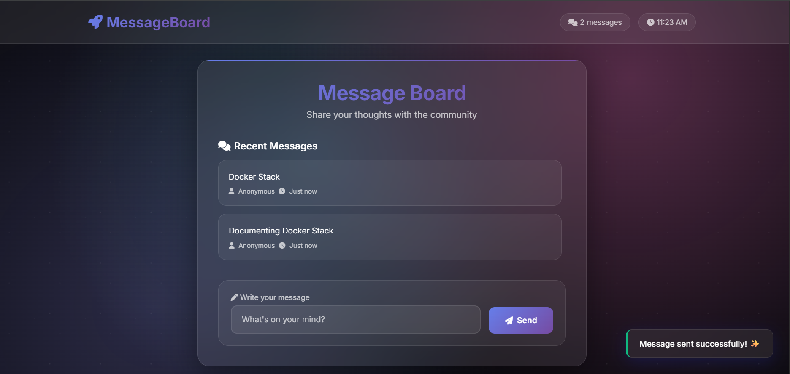

### Prometheus Targets
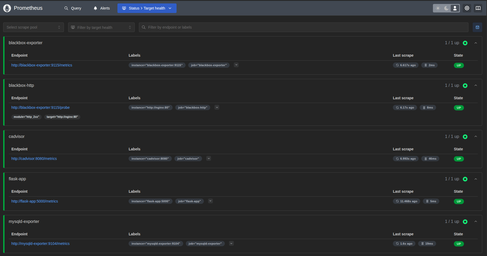

### Alloy
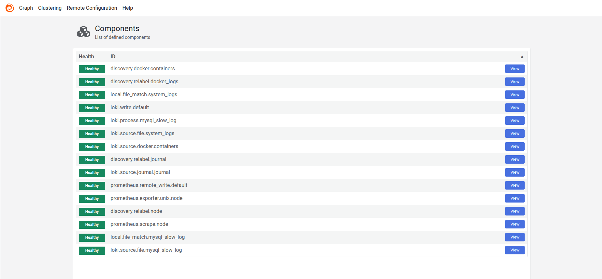
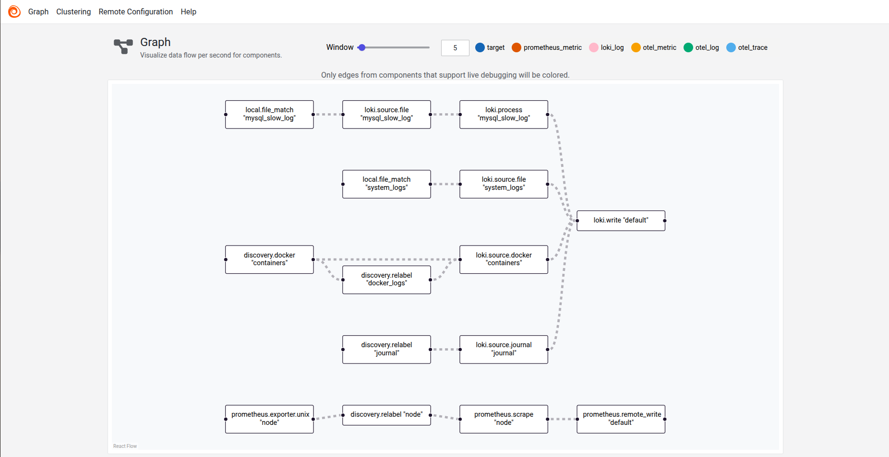

### Grafana
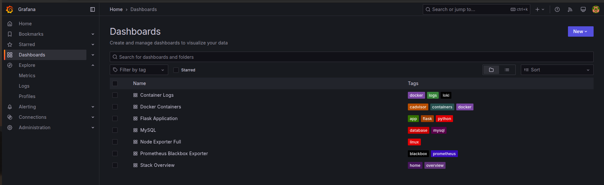
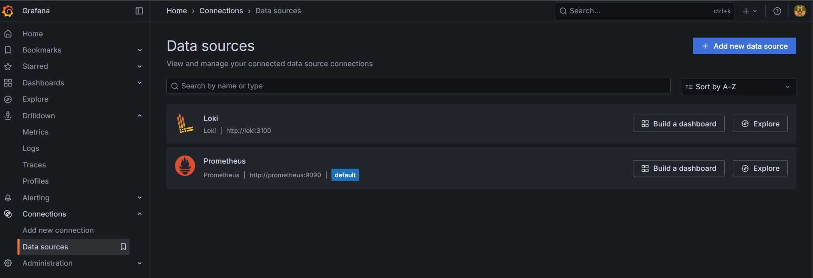
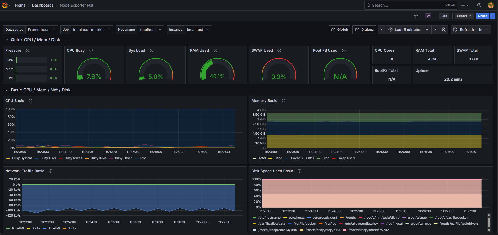
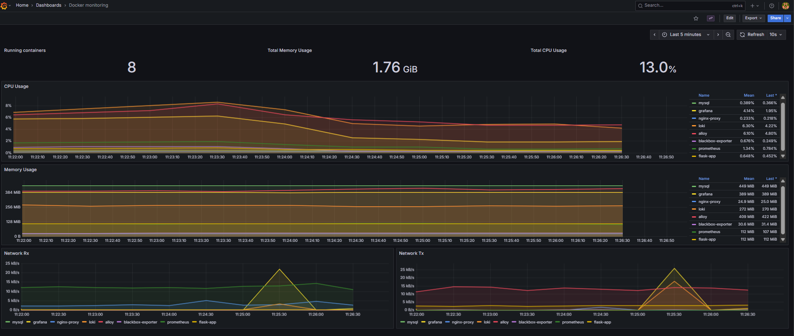
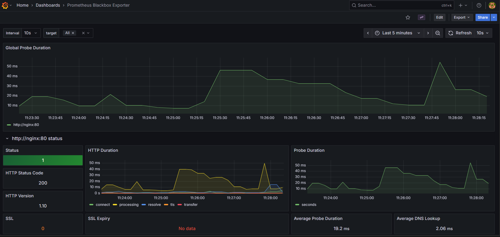
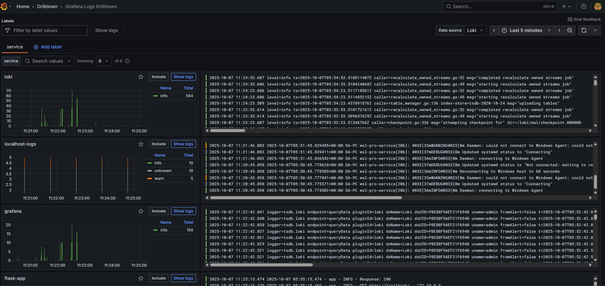
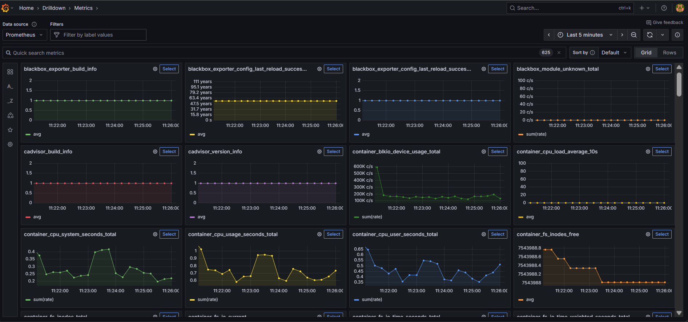
