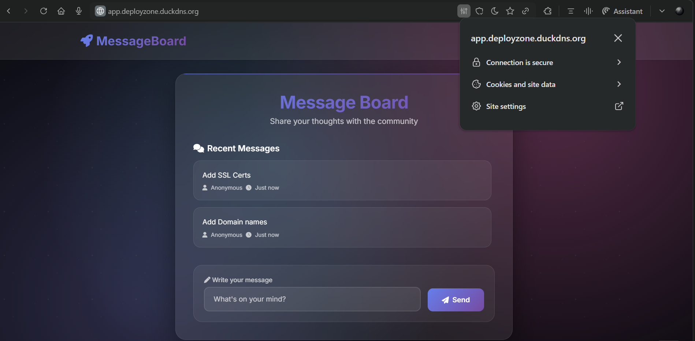
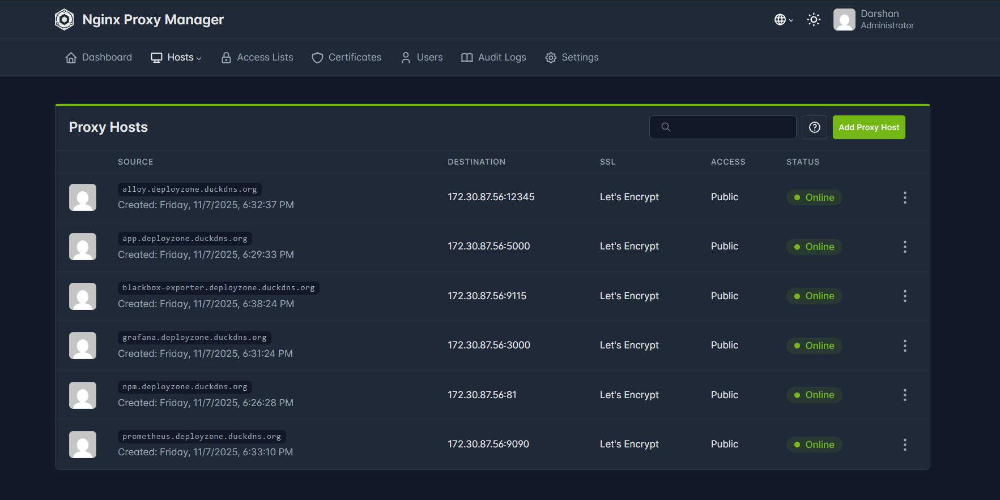
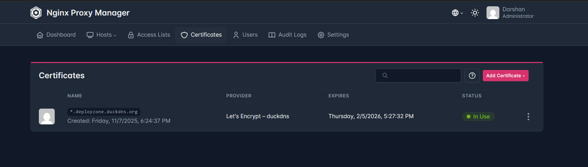
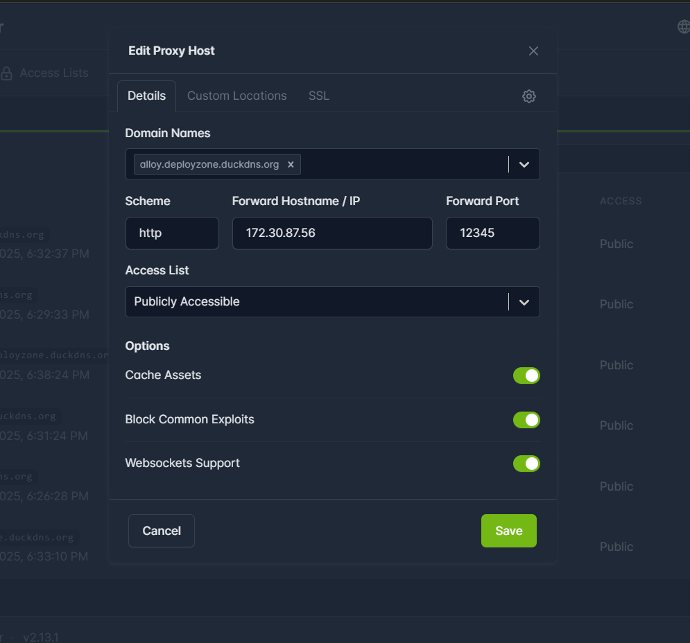
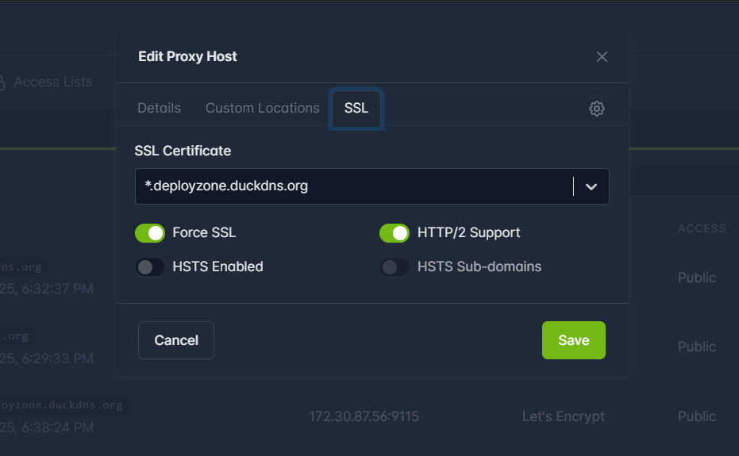
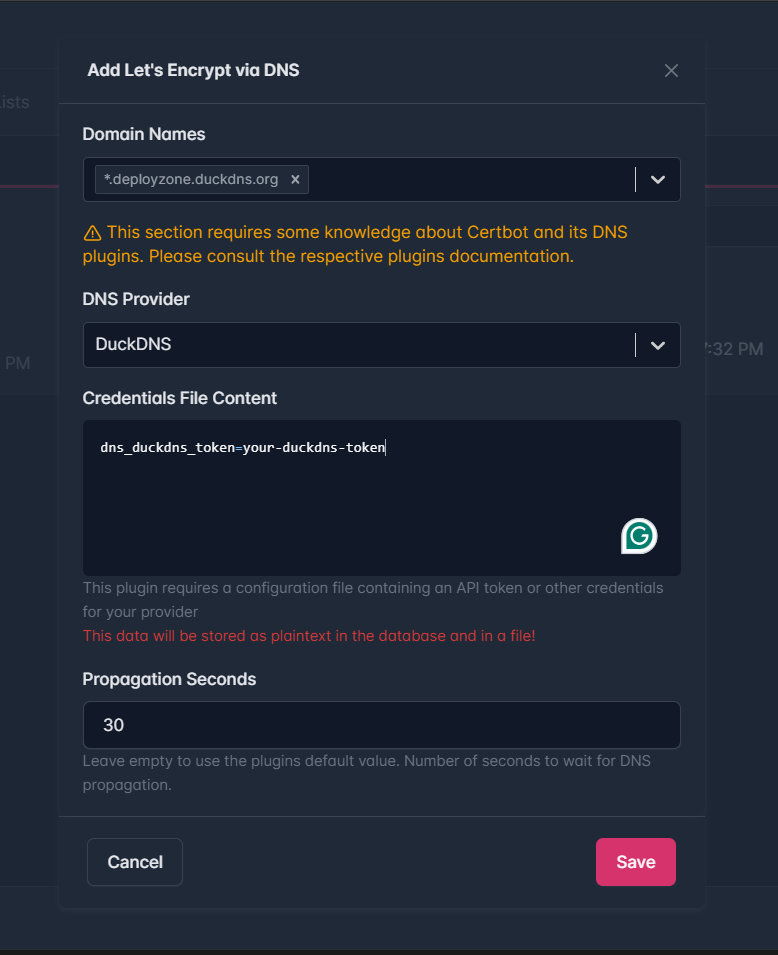
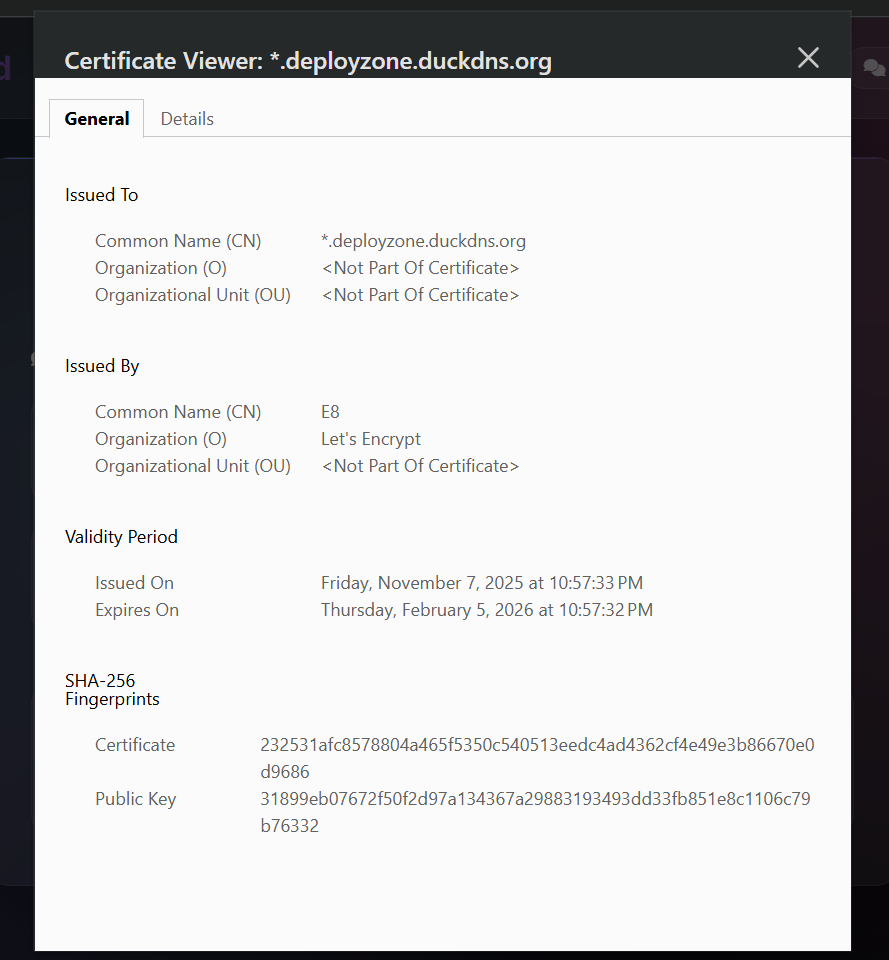
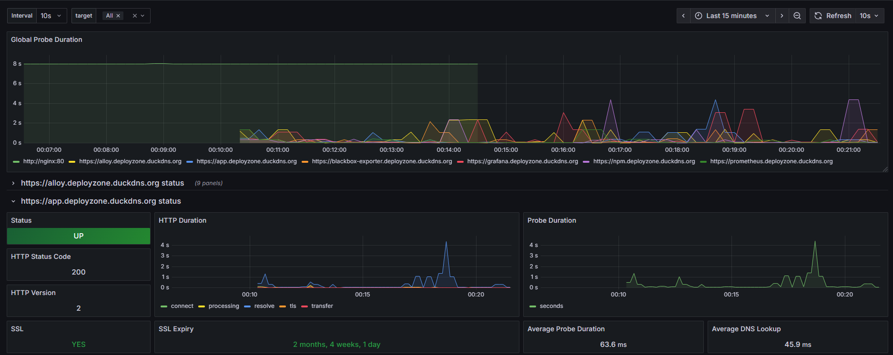

# Domain and SSL Configuration with NGINX Proxy Manager

This guide covers setting up custom domains and SSL certificates using NGINX Proxy Manager for secure access to your Docker Stack services.

## 🌐 Overview

NGINX Proxy Manager provides a web-based interface for managing reverse proxy configurations with automatic SSL certificate generation through Let's Encrypt integration.


*NGINX Proxy Manager main dashboard interface*

## 📊 Management Overview

### All Proxy Hosts


*Overview of all configured proxy hosts*

### SSL Certificates


*Overview of all SSL certificates*

## 🚀 Quick Setup

### 1. Enable NGINX Proxy Manager

Uncomment the nginx-proxy-manager service in `docker-compose.yml`:

```yaml
nginx-proxy-manager:
  image: jc21/nginx-proxy-manager:2.13.1
  container_name: nginx-proxy-manager
  ports:
    - "81:81"
    - "80:80"
    - "443:443"
  networks:
    - app-net
  volumes:
    - ./configs/nginx-proxy-manager/data:/data
    - ./configs/nginx-proxy-manager/letsencrypt:/etc/letsencrypt
  restart: unless-stopped
```

### 2. Start the Service

```bash
docker-compose up -d nginx-proxy-manager
```

### 3. Access Management Interface

- **URL**: http://localhost:81
- **Create Account**:  email / password
   > Note: Use the email by which you have the duckdns.org domain registered

## 📋 Configuration Steps

### Setting Up Proxy Hosts

1. **Add New Proxy Host**
   
   
   *Proxy host details configuration*

2. **Configure SSL Certificate**
   
   
   *SSL certificate setup with Let's Encrypt*

### SSL Certificate Management


*SSL certificate management interface*


*SSL certificate configuration details*

## Blackbox Dashboard


*Grafana dashboard showing Blackbox monitoring through proxy*

## 🔒 Security Features

- **Automatic SSL Renewal**: Let's Encrypt certificates auto-renew
- **Force SSL**: Redirect HTTP to HTTPS automatically  
- **Access Control**: IP whitelisting and authentication

### Log Access

```bash
# View nginx-proxy-manager logs
docker logs nginx-proxy-manager
```
