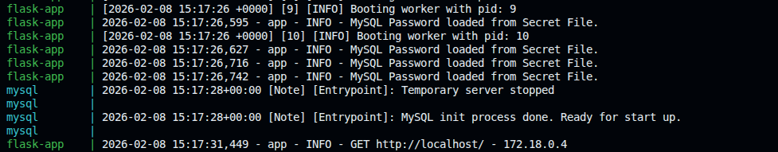
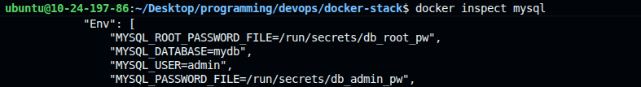

# 🛡️ Secrets Management

Production-grade secrets management using Docker Secrets to securely handle sensitive credentials without exposing them in environment variables or code.

## Why Docker Secrets?

Traditional environment variables expose credentials in multiple ways:

- `docker inspect` reveals all environment variables in plain text
- Application crashes often dump environment variables to logs
- Easy to accidentally commit `.env` files to version control

Docker Secrets solves this by mounting sensitive data as read-only files inside containers at `/run/secrets/<secret_name>`, providing:

- **Read-only access** - Containers can read but not modify secrets
- **Least privilege** - Secrets are only shared with services that need them
- **Decoupled storage** - Application code references file paths, not actual values

## Secrets in This Project

| Secret | Used By | Purpose |
|--------|---------|---------|
| `db_root_pw` | MySQL | Root database password |
| `db_admin_pw` | MySQL, Flask App | Application database user password |

## Implementation

### MySQL Configuration

The MySQL image natively supports `_FILE` suffix environment variables:

```yaml
environment:
  MYSQL_ROOT_PASSWORD_FILE: /run/secrets/db_root_pw
  MYSQL_PASSWORD_FILE: /run/secrets/db_admin_pw
```

### Flask Application

The Flask app prioritizes secret files over environment variables:

```python
secret_path = os.environ.get('MYSQL_PASSWORD_FILE')
if secret_path and os.path.exists(secret_path):
    with open(secret_path, 'r') as f:
        password = f.read().strip()
```

### Docker Compose

Secrets are defined at the bottom of `docker-compose.yml`:

```yaml
secrets:
  db_root_pw:
    file: ./secrets/db_root_pw.txt
  db_admin_pw:
    file: ./secrets/db_admin_pw.txt
```

## Setup

Create secret files in the `secrets/` directory:

```bash
echo "your_secure_root_password" > secrets/db_root_pw.txt
echo "your_secure_admin_password" > secrets/db_admin_pw.txt
```

The `.gitignore` file already excludes `secrets/*.txt` from version control.

## Verification

Start the stack and check the logs:

```bash
docker compose up -d
docker logs flask-app
```



You should see: `MySQL Password loaded from Secret File.`

Inspect a container to verify secrets aren't exposed:

```bash
docker inspect mysql | grep -A 10 Env
```

Environment variables show only file paths, not actual passwords.



## Best Practices

- **Permissions**: Set `chmod 600 secrets/*.txt` to restrict file access
- **Rotation**: Update secret files and restart services with `docker compose up -d --force-recreate`
- **Backup**: Store secrets securely outside the repository (password manager, vault)
- **Never commit**: Ensure `.gitignore` excludes all secret files
